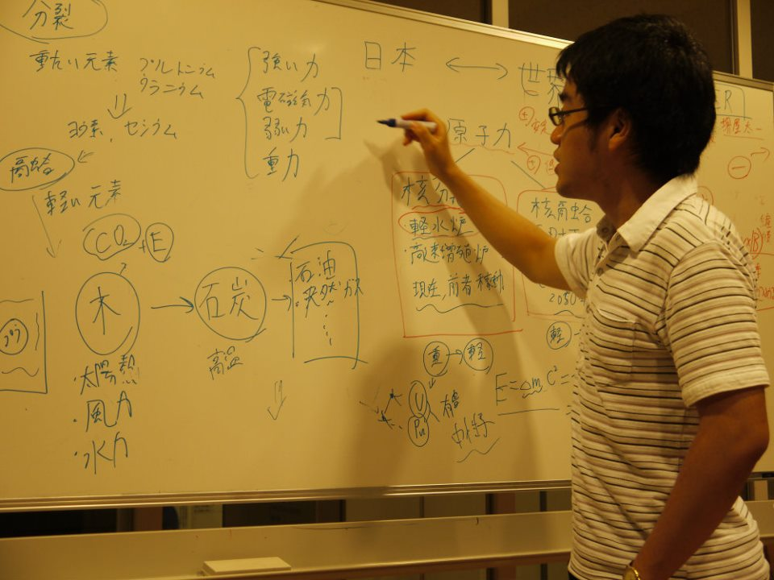

## Welcome to Hidenori Mikami's GithubPage

### About me

I am a Data Scientist working for an pharmaceutical company in Japan.


My interest is in providing safe and  secure future with our descendants by automation and remoteization.
My skills are the followings;
```markdown
<Data Science and AI skills>
2017 ~ Now
- Time series analysis
- Causal analysis
- Image Processing
- Marketing Analysis (including Machen learning)
- Controlling Robotics (ROS)

<Nuclear power plant engineer in plant division>
2012 ~ 2017
- Machine Strucure Design(Seismic design)
- Reliability analysis
- Decontamination design
- Decontamination robot operation at site
```

My job background is the below;
```markdown
Apr.2012 ~ Nov.2017 Nuclear power plant engineer , Toshiba Inc
Nov.2017 ~ Sep.2019 ML Engineer and Project Manager , Arithmer Inc
Oct.2019 ~ Mar.2020 ML Engineer, DeepX Inc
Apr.2020 ~ May.2020 Freerance (Sport consultant)
Jun.2020 ~ Now      Data Scientist, Otsuka Holdings Inc
```


My academic background is the below;
```markdown
Apr.2006 ~ Mar.2010 Undergraduate school of Keio University
Apr.2010 ~ Mar.2012 Graduate school of University of Tokyo

```


Links:
[LinkedIn](https://www.linkedin.com/in/hidenori-mikami-7a58042a/)   
